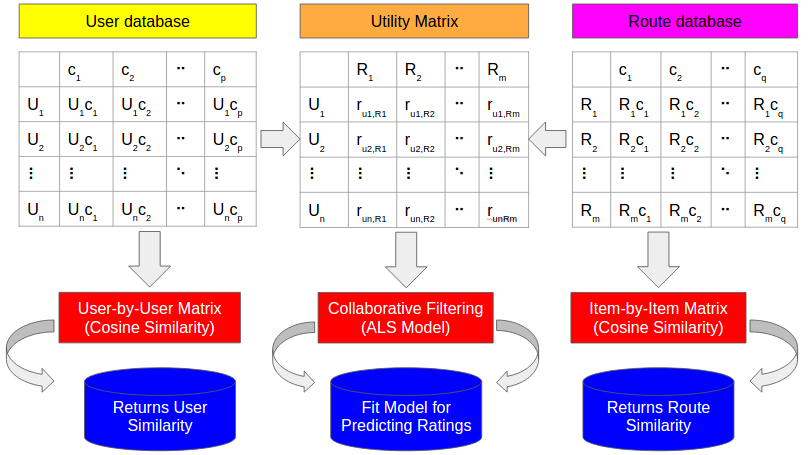
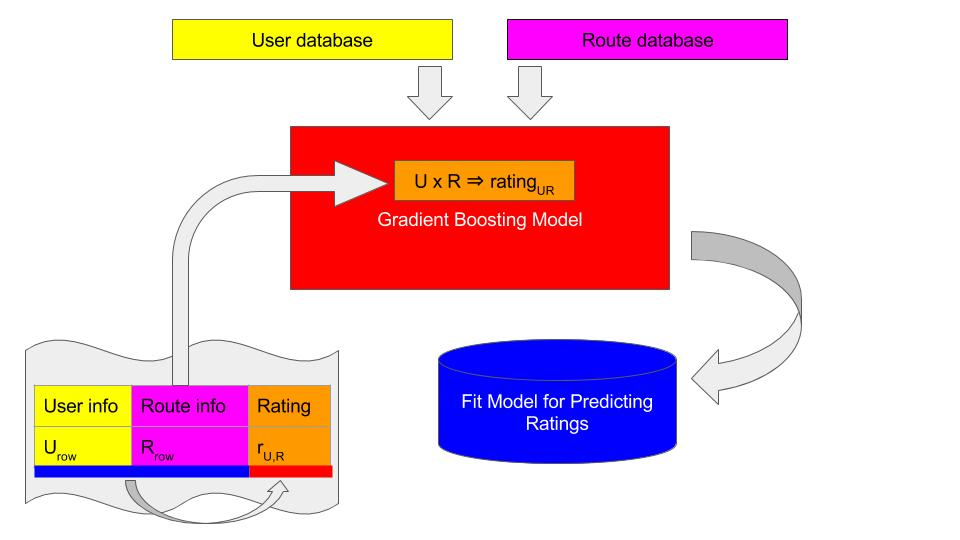
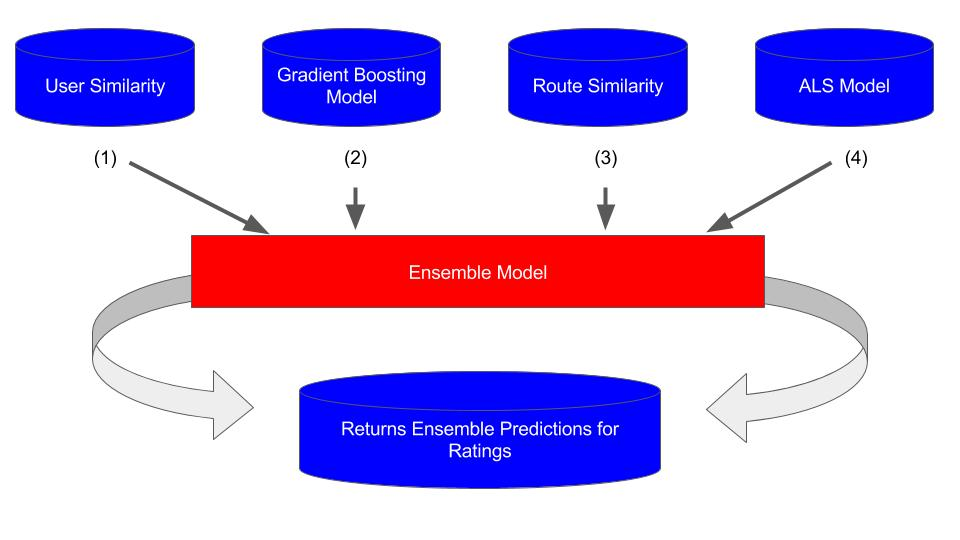
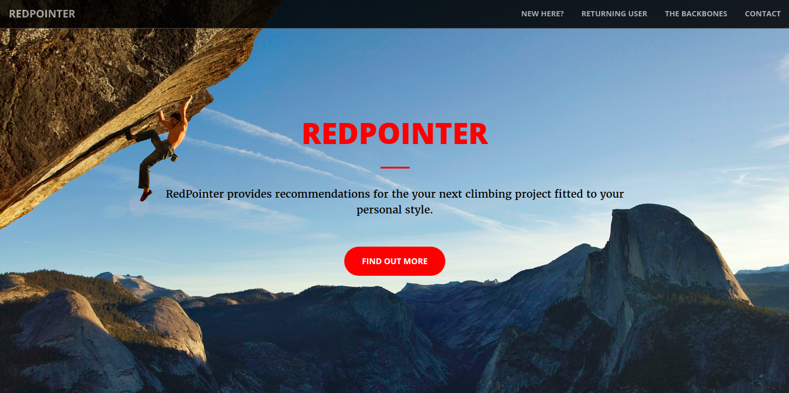
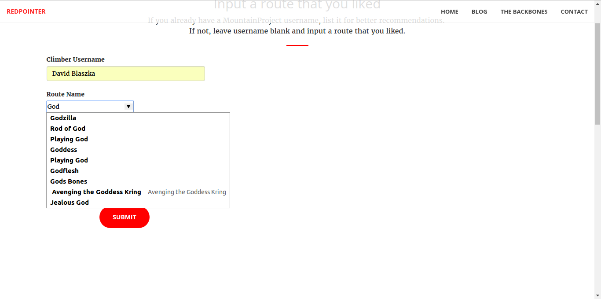
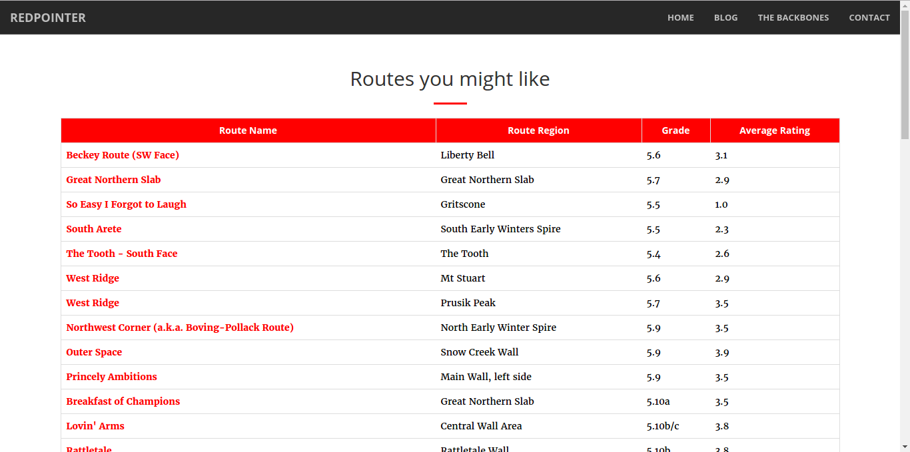

# CRISP-DM:  RedPointer
_Mountian Project Rock Climbing Route Recommender_

**The Cross Industry Standard Process for Data Mining (CRISP-DM) describes guidelines for data scientists who develop data products.**  

## Business Understanding
Mountain Project is a site that provides information on rock climbing routes, with full descriptions and user ratings on the quality of the routes. But there are over 3000 sport and trad climbing routes in Washington alone (not including bouldering or mountaineering routes), so how does someone decide what's their next route?

That's where **RedPointer** comes in. **RedPointer** is a rock climbing route recommender that was built to provide the best route recommendations uniquely fit for an individual's personal style of climbing. 

When a climber is at the crags (climbing area), or deciding at home which crag to go to, he or she can use RedPointer to point them towards the best climb in the area.

## Data Understanding
Routes have several features:
* Name
* Climbing grade
* Average rating
* Type of climb
	- Trad
	- Sport 
	- Bouldering
	- Ice
	- Aid
	- Ice
	- Tope Rope
* Number of pitches
* Height of climb 
* First ascents
* Submitted by
* Descriptions

Users have several consistent features:
* Member since
* Last visit
* Favorite climbs
* Name
* Age
* Live in
* Styles

## Data Preparation
A large part of this project was using Selenium to scrape user and route information off the Mountain Project website. After which, Requests and Beautiful Soup were used to parse the HTML scraped. The HTML was all heavily cleaned in Pandas. This included filling nulls, creating dummy variables for catagorical data, and other feature engineering. 

## Modeling
Three matrices are important here: (1) The user table, which includes information on users, such as age, name, where they live, etc. (2) The route table, which includes information on routes, such as route type, route grade, area of route, etc. (3) The utility matrix, which is a matrix with routes as columns, users as rows, and ratings as the value of where that user rated the route or an unfilled cell. 

The user database provides a way to find user-by-user matrix using cosine similarity. Similarly, an item-by-item matrix, can be found using the route database. Using collaborative filtering on the utility matrix, using alternating least squares (ALS), we can create a model for predicting ratings. This can visualized by the image below:

Alternatively, we can also combine user information with route information to predict routes that were rated by users. If we concatenate the user row of information with the route row of information, we can fit a model to predict these ratings. The model used was a gradient boosted regression. This can visualized by the image below:

Finally, we can take all these models and similarity matrices and combine them into an ensemble model to make predicitons. This can visualized by the image below:

## Evaluation
These models were evaluated with RMSE. The final ensemble model has an RMSE of 0.67, meaning that on average it is +/-0.67 off the rating, which are 1-4 stars. If a user would have rated a route 3 stars, the ensemble model might predict the score between the range of (2.33, 3.67). 

## Deployment
The deployment aspect of this project is in the form a website. 

Users can come to the page, search for popular routes, search for similar routes to ones they enjoy, get recommendations based on thier past behavior, and they can filter the results.

These routes then are linked up with Mountain Project, so that users can go back to the Mountain Project site for further information on the route they're interested in. 

